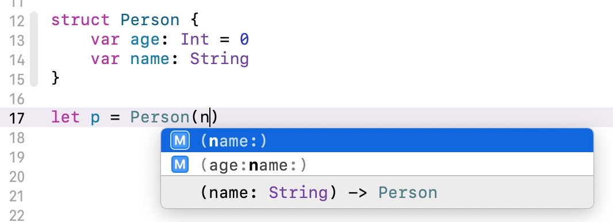
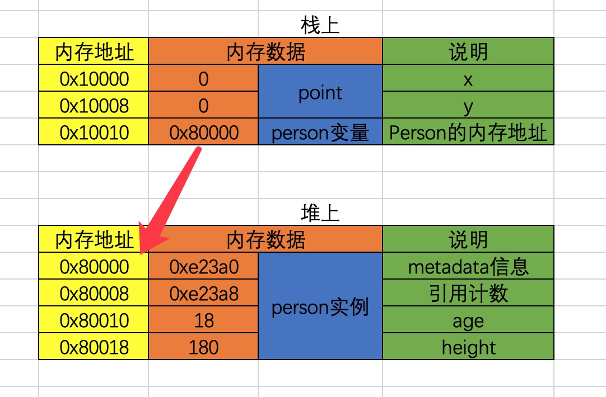
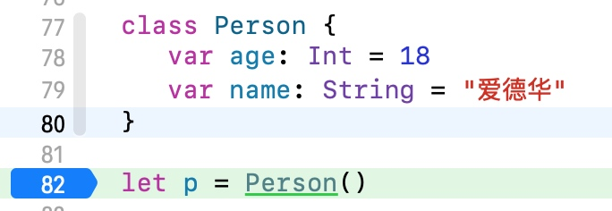
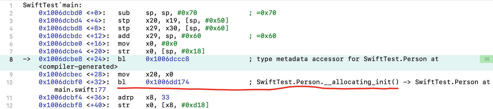
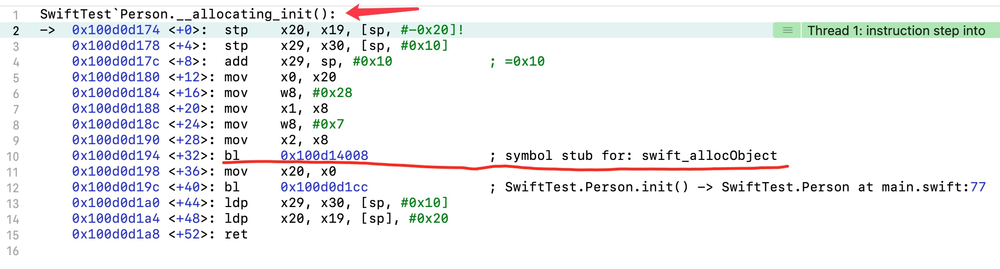
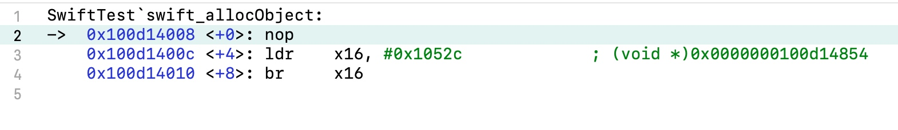
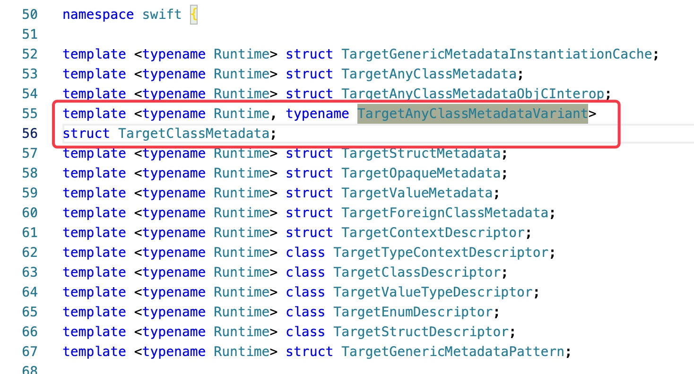

# swift结构体与类的区别和底层知识点
- [swift结构体与类的区别和底层知识点](#swift结构体与类的区别和底层知识点)
- [一、结构体](#一结构体)
  - [初始化器](#初始化器)
  - [自定义初始化器](#自定义初始化器)
  - [内存结构](#内存结构)
- [二、类](#二类)
  - [指定初始化器](#指定初始化器)
  - [可失败初始化器](#可失败初始化器)
  - [必要初始化器](#必要初始化器)
  - [便捷初始化器](#便捷初始化器)
- [三、结构体与类的本质区别](#三结构体与类的本质区别)
  - [值类型](#值类型)
  - [引用类型](#引用类型)
- [四、结构体与类的选择](#四结构体与类的选择)
- [五、类的实例占用内存大小](#五类的实例占用内存大小)
- [六、类的初始化流程](#六类的初始化流程)
- [七、swift类的源码结构](#七swift类的源码结构)
  - [Objective-C与swift的区分调用](#objective-c与swift的区分调用)
  - [源码分析](#源码分析)
  - [实践](#实践)

# 一、结构体
在`swift`的标准库中，绝大多数的公开类型都是结构体，而枚举和类只占很小一部分。比如 `Bool、Int、Double、String、Array、Dictionary`等常见类型都是结构体。

我们现在定义一个结构体，如下代码：

```
struct Person {
    var age: Int = 0
    var name: String
}

let p = Person(age: 20, name: "爱德华")
```

所有的结构体都有一个编译器自动生成的初始化器(初始化方法、构造器、构造方法)。如上代码，可以传入所有成员值，用以初始化所有成员(存储属性，Stored Property)。

## 初始化器
不手动实现初始化时编译器会根据情况为结构体生成多个初始化器。前提是保证所有成员或部分成员都有初始值。

如下图：



## 自定义初始化器
一但在结构体内自定义初始化器，编译器就不会自动生成其他初始化器。

如下代码：

```
struct Person {
    var age: Int
    var name: String

    init(age: Int) {
        self.age = age
        self.name = "爱德华"
    }
}

let p = Person(age: 10)
```

在对结构体进行初始化的时候，必须保证结构体的成员都值，所以当我们对结构体的某个成员变量设置初始值时，生成的初始化器可以不用传该成员变量的参数赋值。

## 内存结构
我们来看如下代码：

```
struct Person {
    var age: Int
    var weight: Int
    var gender: Bool
}

print(MemoryLayout<Person>.size)         // 17
print(MemoryLayout<Person>.alignment)    // 8
print(MemoryLayout<Person>.stride)       // 24
```

在64位系统下，结构体中`Int`占`8`字节，`Bool`占`1`个字节，所以`Person`一共占`17`个字节，但是因为要遵守内存对齐原则(`8`个字节)，所以系统会分配`24`个字节来存储`Person`。

MemoryLayout更多知识参考swift源码或[MemoryLayout](https://juejin.cn/post/6914147790197096456)。

# 二、类
类的定义和结构体类似，但编译器并没有为类自动生成可以传入成员值的初始化器。

## 指定初始化器
当类的成员没有初始值时，必须自定义初始化器，初始化成员值。

如下代码：

```
class Person {
    var age: Int = 10
    var name: String = "爱德华"
}

let p = Person()
```

如果类的所有成员都在定义的时候指定了初始值，编译器会为类生成无参的初始化器，成员的初始化是在这个初始化器中完成的，其实底层等同于如下代码：

```
class Person {
    var age: Int
    var name: String

    init(age: Int, name: String) {
        self.age = age
        self.name = name
    }
}

let p = Person(age: 10, name: "爱德华")
```

## 可失败初始化器
当初始化的值不满足某个条件时我们需要给初始化方法返回一个`nil`，那么可以在`init`后面加上一个可选项来修饰。

如下代码：

```
class Person {
    var age: Int
    var name: String

    init?(age: Int, name: String) {
        if age < 10 { return nil }
        
        self.age = age
        self.name = name
    }
}

let p1 = Person(age: 9, name: "爱德华")
let p2 = Person(age: 18, name: "李好")

print("p1 - ", String(describing: p1))
print("p2 - ", String(describing: p2))

打印结果：
p1 - nil
p2 - Optional(SwiftTest.Person)
```

例如：当`Person`不满`10`岁时返回`nil`。

## 必要初始化器
必要初始化器需要在`init`前用`required`修饰。

如下代码：

```
class Person {
    var age: Int
    var name: String
    
    /// 父类定义必要实现初始化器
    required init(age: Int, name: String) {
        self.age = age
        self.name = name
    }
}

class Student: Person {
    var height: Int

    init(height: Int) {
        self.height = height
        super.init(age: 10, name: "爱德华")
    }

    /// 子类必须实现父类的必要初始化器
    required init(age: Int, name: String) {
        fatalError("init(age:name:) has not been implemented")
    }
}
```

如代码所示：当在`init`前修饰`required`，该类的子类都必须实现该初始化器。

## 便捷初始化器
我们可以为类提供一个便捷初始化器，便捷初始化器需要在`init`前用`convenience`修饰。

如下代码：

```
class Person {
    var age: Int
    var name: String

    init(age: Int, name: String) {
        self.age = age
        self.name = name
    }

    convenience init() {
        self.init(age: 10, name: "爱德华")
    }
}
```

如代码所示，便捷初始化器必须从相同的类里调用另一个初始化器，并且最终必须调用一个指定初始化器。

# 三、结构体与类的本质区别
结构体与类的本质区别为结构体是值类型，类是引用类型(其实也可以理解为指针类型)。那么它们还有一个最直观的区别就是存储的位置不同：一般情况：`值类型存储的在栈上，引用类型存储在堆上`。

如下代码：

```
class Person {
    var age = 18
    var height = 180
}

struct Point {
    var x = 0;
    var y = 0;
}

let person = Person()
let point = Point()
```

分析如图示例：



`Point`在初始化完成赋值给`point`后，`point`的内存数据直接就是放在栈空间。而 `Person`在初始化完成赋值给`person`后，`person`只是一个引用地址，这个地址存的内存数据为`Person`实例化的内存地址，该内存地址放在堆空间。

## 值类型
值类型赋值给`var`、`let`或者给函数传参，是直接将所有内容拷贝一份。类似于对文件进行`copy`、`paste`操作，产生了全新的文件副本。属于深拷贝(deep copy)。

如下代码：

```
struct Point {
    var x = 4;
    var y = 8;
}

var p1 = Point()
var p2 = p1;

p2.x = 6

print("p1 - ", p1)
print("p2 - ", p2)

打印结果：
p1 - Point(x: 4, y: 8)
p2 - Point(x: 6, y: 8)
```

我们可以看到在修改`p2`的`x`后，对`p1`并没有影响，这属于深拷贝。我们来看数组的打印结果。

如下代码：

```
var a1 = [1, 2, 3]
var a2 = a1

a2.append(4)
a1[0] = 2

print("a1 - ", a1)
print("a2 - ", a2)

打印结果：
a1 - [2, 2, 3]
a2 - [1, 2, 3, 4]
```

在`swift`标准库中，为了提升性能，`String`、`Array`、`Dictionary`、`Set`采取了`Copy On Write`的技术, 比如仅当有“写”操作时，才会真正执行拷贝操作。
对于标准库值类型的赋值操作，`swift`能确保最佳性能，所有没必要为了保证最佳性能来避免赋值。

建议：不需要修改的，尽量定义成`let`。

## 引用类型
引用赋值给`var`、`let`或者给函数传参，是将内存地址拷贝一份。类似于制作一个文件的替身(快捷方式、链接)，指向的是同一个文件。属于浅拷贝(shallow copy)。

如下代码：

```
class Person {
    var age: Int = 18
    var name: String = "爱德华"
}

let p1 = Person()
let p2 = p1

print("p1-age = ", p1.age)

p2.age = 20
print("p1-age = ", p1.age)
print("p2-age = ", p2.age)

func test(p: Person) {
    p.age = 30
    print("test-p-age = ", p1.age)
}

test(p: p2)

print("p1-age = ", p1.age)
print("p2-age = ", p2.age)

打印结果：
p1-age =  18
p1-age =  20
p2-age =  20
test-p-age =  30
p1-age =  30
p2-age =  30
```

# 四、结构体与类的选择
结构体与类的使用方式很相似，那么在平时开发中使用结构体比较好还是类比较好呢？这种时候分情况，如果定义的数据结构比较简单的情况下，建议用结构体，比如`Model`。如果定义的数据结构比较复杂的话，建议用类，比如需要用到多态的时候。
1. 一般情况结构体的内存分配在栈空间，当结构体用完时，会自动释放内存，不需要进行额外的处理。
2. 类的内存分配在堆空间，系统需要对类的内存大小进行分配以及析构等操作，相对于结构体，性能会有所消耗。

# 五、类的实例占用内存大小
看如下代码：

```
class HDPoint  {
    var x = 10
    var y = 20
    var isZero = false
}

var po = HDPoint()

print(class_getInstanceSize(HDPoint.self))

// unsafeBitCast是忽略数据类型的强制转换，不会因为数据类型的变化而改变原来的内存数据，类似于C++中的reinterpret_cast。
print(malloc_size(unsafeBitCast(po, to: UnsafeRawPointer.self)))

打印结果：
40
48
```

class_getInstanceSize： 返回类实例的大小。
malloc_size：系统分配的内存大小。

1. 通过打印得知，`HDPoint`的大小为`40`个字节，系统分配`HDPoint`的内存大小为`48`个字节。
2. 在`HDPoint`中，`x`占`8`个字节，`y`占8个字节，`isZero`占`1`个字节，所以目前我们看到的有`17`个字节。但是因为类存储在堆空间中，它前面会有`8`个字节存放类型信息，`8`个字节存引用计数，再加上面的，加起来一共是`33`个字节，根据内存对齐原则（`8`个字节），所以`HDPoint 的大小为 40 个字节。
3. 因为在`macOS`、`iOS`中的`malloc`函数分配的内存大小总是`16`的倍数，所以最终系统会分配`HDPoint`的内存大小为`48`字节。

在`macOS`、`iOS`中的`malloc`函数分配的内存大小总是16的倍数。
查看源码路径：objc4-818.2/runtime/objc-runtime.h

如下代码：

```
inline size_t instanceSize(size_t extraBytes) const {
    if (fastpath(cache.hasFastInstanceSize(extraBytes))) {
        return cache.fastInstanceSize(extraBytes);
    }

    size_t size = alignedInstanceSize() + extraBytes;
    // CF requires all objects be at least 16 bytes.
    if (size < 16) size = 16;
    return size;
}
```

# 六、类的初始化流程
接下来我们通过汇编来查看类的初始化流程，我们打个断点如下图：



通过Xcode的菜单栏->Debug->Debug Workflow->Always Show Disassembly打开汇编调试。

如下图1：


通过汇编查看，`Person`在进行初始化的时候，在底层会调用`Person.__allocating_init()`的函数，那么`__allocating_init()`做了什么事情呢，我们继续跟进去看一下。

在控制台`(lldb)`输入`ni或n`指令让断点走到画红线的地方或者直接在10行打断点然后控制台`(lldb)`输入一个`c`直接断到`Person.__allocating_init()`这一行代码，再在控制台`(lldb)`输入一个`si或s`指令，进入此函数。

如下图2：



可以看到，进入到`Person.__allocating_init()`的内部实现后，发现它会调用一个`swift_allocObject`函数，那么在继续跟汇编的时候跟丢了。

如下图3：


接下来我们来看一下[swift](https://github.com/apple/swift)源码。用自己喜欢的IDE打开下载好的`swift`源码，全局搜索`swift_allocObject`这个函数。在`HeapObject.cpp`文件中找到`swift_allocObject`函数的实现。

如下代码：
```
HeapObject *swift::swift_allocObject(HeapMetadata const *metadata,
                                     size_t requiredSize,
                                     size_t requiredAlignmentMask) {
  CALL_IMPL(swift_allocObject, (metadata, requiredSize, requiredAlignmentMask));
}
```

第一个参数`metadata`可以如`图1`的第8行 `bl 0x1006dccc8`返回，其实在`swift_allocObject`函数的内部调用`CALL_IMPL`就等于胶水前后拼接`_`，因此实际调用`_swift_allocObject_`函数的实现。

如下代码：

```
static HeapObject *_swift_allocObject_(HeapMetadata const *metadata,
                                       size_t requiredSize,
                                       size_t requiredAlignmentMask) {
  assert(isAlignmentMask(requiredAlignmentMask));
  auto object = reinterpret_cast<HeapObject *>(
      swift_slowAlloc(requiredSize, requiredAlignmentMask));

  // NOTE: this relies on the C++17 guaranteed semantics of no null-pointer
  // check on the placement new allocator which we have observed on Windows,
  // Linux, and macOS.
  new (object) HeapObject(metadata);

  // If leak tracking is enabled, start tracking this object.
  SWIFT_LEAKS_START_TRACKING_OBJECT(object);

  SWIFT_RT_TRACK_INVOCATION(object, swift_allocObject);

  return object;
}
```

在函数的内部会调用一个`swift_slowAlloc`函数。

如下代码：

```
void *swift::swift_slowAlloc(size_t size, size_t alignMask) {
  void *p;
  // This check also forces "default" alignment to use AlignedAlloc.
  if (alignMask <= MALLOC_ALIGN_MASK) {
#if defined(__APPLE__) && SWIFT_STDLIB_HAS_DARWIN_LIBMALLOC
    p = malloc_zone_malloc(DEFAULT_ZONE(), size);
#else
    p = malloc(size);
#endif
  } else {
    size_t alignment = (alignMask == ~(size_t(0)))
                           ? _swift_MinAllocationAlignment
                           : alignMask + 1;
    p = AlignedAlloc(size, alignment);
  }
  if (!p) swift::crash("Could not allocate memory.");
  return p;
}
```

`swift_slowAlloc`函数的内部是去进行一些分配内存的操作，比如其中一行`p = malloc(size);`。所以就印证了类的内存分配是在堆上。

在`swift`中，创建类的实例对象，要向堆空间申请内存，大致流程如下：

1. Class.__allocating_init()
2. libswiftCore.dylib: swift_allocObject
3. libswiftCore.dylib: swift_slowAlloc
4. libsystem_malloc.dylib: malloc

# 七、swift类的源码结构
## Objective-C与swift的区分调用
在调用``_swift_allocObject_``函数的时候有一个参数，名为`metadata`的`HeapMetadata`。跳转到`HeapMetadata`呈现如下代码：

```
#ifndef __swift__
#include <type_traits>
#include "swift/Basic/type_traits.h"

namespace swift {

struct InProcess;

template <typename Target> struct TargetHeapMetadata;

// HeapMetadata为TargetHeapMetadata的别名，InProcess为泛型。
using HeapMetadata = TargetHeapMetadata<InProcess>;
#else
typedef struct HeapMetadata HeapMetadata;
typedef struct HeapObject HeapObject;
#endif

```

`HeapMetadata`为`TargetHeapMetadata`的别名。
我们接着搜索`TargetHeapMetadata`

如下代码：

```
/// The common structure of all metadata for heap-allocated types.  A
/// pointer to one of these can be retrieved by loading the 'isa'
/// field of any heap object, whether it was managed by Swift or by
/// Objective-C.  However, when loading from an Objective-C object,
/// this metadata may not have the heap-metadata header, and it may
/// not be the Swift type metadata for the object's dynamic type.
template <typename Runtime>
struct TargetHeapMetadata : TargetMetadata<Runtime> {
  using HeaderType = TargetHeapMetadataHeader<Runtime>;

  TargetHeapMetadata() = default;
  constexpr TargetHeapMetadata(MetadataKind kind)
    : TargetMetadata<Runtime>(kind) {}
  constexpr TargetHeapMetadata(TargetAnyClassMetadataObjCInterop<Runtime> *isa)
    : TargetMetadata<Runtime>(isa) {}
};
using HeapMetadata = TargetHeapMetadata<InProcess>;
```

在这里有对`Objective-C`和`swift`做兼容。调用的`TargetHeapMetadata`函数的时候，如果是`Objective-C`的类，那么参数为`isa`指针，否则就是一个`MetadataKind`类型。

`MetadataKind`是一个`uint32_t`的类型，如下代码：

```
enum class MetadataKind : uint32_t {
#define METADATAKIND(name, value) name = value,
#define ABSTRACTMETADATAKIND(name, start, end)                                 \
  name##_Start = start, name##_End = end,
#include "MetadataKind.def"
  
  /// The largest possible non-isa-pointer metadata kind value.
  ///
  /// This is included in the enumeration to prevent against attempts to
  /// exhaustively match metadata kinds. Future Swift runtimes or compilers
  /// may introduce new metadata kinds, so for forward compatibility, the
  /// runtime must tolerate metadata with unknown kinds.
  /// This specific value is not mapped to a valid metadata kind at this time,
  /// however.
  LastEnumerated = 0x7FF,
};
```

在`ReflectionMirror.swift`文件中`MetadataKind`的类型如下代码：

```
/// The metadata "kind" for a type.
@available(SwiftStdlib 5.2, *)
@_spi(Reflection)
public enum _MetadataKind: UInt {
  // With "flags":
  // runtimePrivate = 0x100
  // nonHeap = 0x200
  // nonType = 0x400
  
  case `class` = 0
  case `struct` = 0x200     // 0 | nonHeap
  case `enum` = 0x201       // 1 | nonHeap
  case optional = 0x202     // 2 | nonHeap
  case foreignClass = 0x203 // 3 | nonHeap
  case opaque = 0x300       // 0 | runtimePrivate | nonHeap
  case tuple = 0x301        // 1 | runtimePrivate | nonHeap
  case function = 0x302     // 2 | runtimePrivate | nonHeap
  case existential = 0x303  // 3 | runtimePrivate | nonHeap
  case metatype = 0x304     // 4 | runtimePrivate | nonHeap
  case objcClassWrapper = 0x305     // 5 | runtimePrivate | nonHeap
  case existentialMetatype = 0x306  // 6 | runtimePrivate | nonHeap
  case heapLocalVariable = 0x400    // 0 | nonType
  case heapGenericLocalVariable = 0x500 // 0 | nonType | runtimePrivate
  case errorObject = 0x501  // 1 | nonType | runtimePrivate
  case unknown = 0xffff
  
  init(_ type: Any.Type) {
    let v = _metadataKind(type)
    if let result = _MetadataKind(rawValue: v) {
      self = result
    } else {
      self = .unknown
    }
  }
}
```

## 源码分析
接下来我们找到`TargetHeapMetadata`的继承`TargetMetadata`（在`C++`中结构体是允许继承的）。在`TargetMetadata`结构体中找到了`getTypeContextDescriptor`函数，如下代码：

```
/// Get the nominal type descriptor if this metadata describes a nominal type,
/// or return null if it does not.
ConstTargetMetadataPointer<Runtime, TargetTypeContextDescriptor>
getTypeContextDescriptor() const {
  switch (getKind()) {
  case MetadataKind::Class: {
    if (Runtime::ObjCInterop) {
      const auto cls = static_cast<const TargetClassMetadata<
          Runtime, TargetAnyClassMetadataObjCInterop<Runtime>> *>(this);
      if (!cls->isTypeMetadata())
        return nullptr;
      if (cls->isArtificialSubclass())
        return nullptr;
      return cls->getDescription();
    } else {
      const auto cls = static_cast<const TargetClassMetadata<
          Runtime, TargetAnyClassMetadata<Runtime>> *>(this);
      if (!cls->isTypeMetadata())
        return nullptr;
      if (cls->isArtificialSubclass())
        return nullptr;
      return cls->getDescription();
    }
  }
  case MetadataKind::Struct:
  case MetadataKind::Enum:
  case MetadataKind::Optional:
    return static_cast<const TargetValueMetadata<Runtime> *>(this)
        ->Description;
  case MetadataKind::ForeignClass:
    return static_cast<const TargetForeignClassMetadata<Runtime> *>(this)
        ->Description;
  default:
    return nullptr;
  }
}
```

可以看到，当`getKind()`匹配`case MetadataKind::Class:`的时候，会拿到一个名为`TargetClassMetadata`的指针，我们看看`TargetClassMetadata`的实现。

如下代码：

```
/// The structure of all class metadata.  This structure is embedded
/// directly within the class's heap metadata structure and therefore
/// cannot be extended without an ABI break.
///
/// Note that the layout of this type is compatible with the layout of
/// an Objective-C class.
///
/// If the Runtime supports Objective-C interoperability, this class inherits
/// from TargetAnyClassMetadataObjCInterop, otherwise it inherits from
/// TargetAnyClassMetadata.
template <typename Runtime, typename TargetAnyClassMetadataVariant>
struct TargetClassMetadata : public TargetAnyClassMetadataVariant {
  using StoredPointer = typename Runtime::StoredPointer;
  using StoredSize = typename Runtime::StoredSize;

  TargetClassMetadata() = default;
  constexpr TargetClassMetadata(const TargetAnyClassMetadataVariant &base,
                                ClassFlags flags,
                                ClassIVarDestroyer *ivarDestroyer,
                                StoredPointer size, StoredPointer addressPoint,
                                StoredPointer alignMask,
                                StoredPointer classSize,
                                StoredPointer classAddressPoint)
      : TargetAnyClassMetadataVariant(base), Flags(flags),
        InstanceAddressPoint(addressPoint), InstanceSize(size),
        InstanceAlignMask(alignMask), Reserved(0), ClassSize(classSize),
        ClassAddressPoint(classAddressPoint), Description(nullptr),
        IVarDestroyer(ivarDestroyer) {}

  // The remaining fields are valid only when isTypeMetadata().
  // The Objective-C runtime knows the offsets to some of these fields.
  // Be careful when accessing them.

  /// Swift-specific class flags.
  ClassFlags Flags;

  /// The address point of instances of this type.
  uint32_t InstanceAddressPoint;

  /// The required size of instances of this type.
  /// 'InstanceAddressPoint' bytes go before the address point;
  /// 'InstanceSize - InstanceAddressPoint' bytes go after it.
  uint32_t InstanceSize;

  /// The alignment mask of the address point of instances of this type.
  uint16_t InstanceAlignMask;

  /// Reserved for runtime use.
  uint16_t Reserved;

  /// The total size of the class object, including prefix and suffix
  /// extents.
  uint32_t ClassSize;

  /// The offset of the address point within the class object.
  uint32_t ClassAddressPoint;

  ...此处省略N行代码。
};
```

在这里我们可以看见熟悉的内容`ClassIVarDestroyer、Flags、InstanceAddressPoint、InstanceSize、InstanceAlignMask、ClassSize、ClassAddressPoint`等等信息。

我们根据`TargetClassMetadata`查找`TargetAnyClassMetadataVariant`其实就是模板泛型。

如下图：


```
根据开源代码中的注释：
/// If the Runtime supports Objective-C interoperability, this class inherits
/// from TargetAnyClassMetadataObjCInterop, otherwise it inherits from
/// TargetAnyClassMetadata.
----
如果运行时支持Objective-C互操作性，则TargetClassMetadata此类将继承来自TargetAnyClassMetadataObjInterop，否则继承自TargetAnyClassMetadata。
```

我们在继续看它的继承`TargetAnyClassMetadata`

如下代码：

```
/// The portion of a class metadata object that is compatible with
/// all classes, even non-Swift ones.
template <typename Runtime>
struct TargetAnyClassMetadata : public TargetHeapMetadata<Runtime> {
  using StoredPointer = typename Runtime::StoredPointer;
  using StoredSize = typename Runtime::StoredSize;
  using TargetClassMetadata =
      typename Runtime::template TargetClassMetadata<Runtime>;

protected:
  constexpr TargetAnyClassMetadata(
      TargetAnyClassMetadataObjCInterop<Runtime> *isa,
      TargetClassMetadata *superclass)
      : TargetHeapMetadata<Runtime>(isa), Superclass(superclass) {}
public:
  constexpr TargetAnyClassMetadata(TargetClassMetadata *superclass)
      : TargetHeapMetadata<Runtime>(MetadataKind::Class),
        Superclass(superclass) {}

  // Note that ObjC classes do not have a metadata header.

  /// The metadata for the superclass.  This is null for the root class.
  TargetSignedPointer<Runtime, const TargetClassMetadata *
                                   __ptrauth_swift_objc_superclass>
      Superclass;

  /// Is this object a valid swift type metadata?  That is, can it be
  /// safely downcast to ClassMetadata?
  bool isTypeMetadata() const {
    return true;
  }
  /// A different perspective on the same bit.
  bool isPureObjC() const {
    return !isTypeMetadata();
  }
};
```

可以看到更为熟悉的`isa，superclass`等等信息。

## 实践
通过以上的分析，我们可以得出，`swift`类中的`metadata`数据结构大致如下：
更详细的可以参考`HandyJSON`复原结构

如下代码：

```
struct Metadata {
    var kind: Int
    var superClass: Any.Type
    var cacheData: (Int, Int)
    var data: Int
    var classFlags: Int32
    var instanceAddressPoint: UInt32
    var instanceSize: UInt32
    var instanceAlignmentMask: UInt16
    var reserved: UInt16
    var classSize: UInt32
    var classAddressPoint: UInt32
    var typeDescriptor: UnsafeMutableRawPointer
    var iVarDestroyer: UnsafeRawPointer
}
```

接下来我们做一个测试，通过`lldb`查看`swift`类的内存结构，那么既然在`swift`的底层，`_swift_allocObject_`函数返回`HeapObject`的指针类型，我们来看一下`HeapObject`的结构：

如下代码：

```
/// The Swift heap-object header.
/// This must match RefCountedStructTy in IRGen.
struct HeapObject {
  /// This is always a valid pointer to a metadata object.
  HeapMetadata const *__ptrauth_objc_isa_pointer metadata;

  SWIFT_HEAPOBJECT_NON_OBJC_MEMBERS;

#ifndef __swift__
  HeapObject() = default;

  // Initialize a HeapObject header as appropriate for a newly-allocated object.
  constexpr HeapObject(HeapMetadata const *newMetadata) 
    : metadata(newMetadata)
    , refCounts(InlineRefCounts::Initialized)
  { }
  
  // Initialize a HeapObject header for an immortal object
  constexpr HeapObject(HeapMetadata const *newMetadata,
                       InlineRefCounts::Immortal_t immortal)
  : metadata(newMetadata)
  , refCounts(InlineRefCounts::Immortal)
  { }

#ifndef NDEBUG
  void dump() const SWIFT_USED;
#endif

#endif // __swift__
};
```

知道了`HeapObject`的源码结构之后，我们也可以模仿源码，自己定义一个`HeapObject`，主要看`metadata`，引用计数`refCounts`先忽略。

如下代码：

```
struct HeapObject {
    var metadata: UnsafeRawPointer
    var refCounts: UInt32
}
```

接下来我们将`Person`类转成`HeapObject`结构体，然后通过`lldb`指令`x/8g`打印查看其内存结构。

如下代码：

```
class Person {
    var age = 18
    var name = "爱德华"
}

let p = Person()

// 将 Person 转成 HeapObject 指针
let p_raw_ptr = Unmanaged.passUnretained(p as AnyObject).toOpaque()

// 将 p_ptr 指针转成 HeapObject 的指针类型并打印出 HeapObject 的内存结构
let p_ptr = p_raw_ptr.bindMemory(to: HeapObject.self, capacity: 1)

// 将 HeapObject 中的 metadata 绑定成 Metadata 类型，并转成 Metadata 的指针类型，数据类型的大小可以用 MemoryLayout 计算得出。
let metadata = p_ptr.pointee.metadata.bindMemory(to: Metadata.self, capacity: MemoryLayout<Metadata>.stride).pointee

print(p_ptr.pointee)
// 此处断点，lldb 执行如：x/8gx 0x0000000102738828（16进制打印8段）
print(metadata)

// 打印信息：
HeapObject(metadata: 0x0000000104f98828, refCounts: 2)

Metadata(kind: 4378429424,
         superClass: Swift._SwiftObject,
         cacheData: (7182105232, 206158430208),
         data: 10751708546,
         classFlags: 2,
         instanceAddressPoint: 0,
         instanceSize: 40,
         instanceAlignmentMask: 7,
         reserved: 0,
         classSize: 168,
         classAddressPoint: 16,
         typeDescriptor: 0x0000000104F87210,
         iVarDestroyer: 0x0000000000000000)
```

我们成功的打印出`kind、superClass、cacheData`等等成员变量的信息。

Metadata更多知识参考swift源码：[Metadata](https://github.com/apple/swift/blob/main/docs/ABI/TypeMetadata.rst)